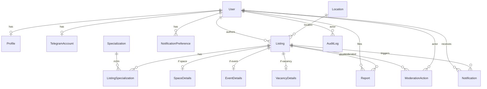

# 09 — Database Architecture (архитектура базы данных)

**Связано:** [08](08-system-architecture.md) · [10](10-api-specification.md) · [12](12-security-plan.md)

Логическая модель. Физические типы — ориентир для PostgreSQL, не миграции.

Город в UI один; иерархия гео хранится для расширения.

---

## Принцип

Не плодить сущности «на вырост». SearchIntent, Match, Collaboration, Favorite — **Future/P1**, описаны отдельно. В MVP можно не создавать таблицы.

AuditLog и ModerationAction — P0 (споры и жалобы).

---

## ER (Mermaid)



---

## Справочники

### Location (локация)

- **purpose:** страна/регион/город/район. UI MVP: фильтр `district` внутри города Ростов.
- **fields:** `id`, `parent_id` nullable, `level` enum `country|region|city|district`, `slug`, `name`, `is_active`
- **relationships:** дерево через `parent_id`
- **indexes:** `(level, slug)` unique, `parent_id`
- **constraints:** district обязан иметь parent city. Seed районов: [24 §4.2](24-implementation-spec.md)
- **lifecycle:** seed миграцией; админ может скрыть `is_active`

Состав районов Ростова: `RESEARCH REQUIRED` (смешение официальных районов и бытовых «ЗЖМ», «Северный»).

### Specialization (специализация)

- **purpose:** направления мастеров и фильтр карточек
- **fields:** `id`, `slug` unique, `name`, `sort_order`, `is_active`
- **lifecycle:** seed 7 значений MVP; P1 — админ CRUD

---

## MVP-сущности

### User (пользователь)

- **purpose:** идентичность, RBAC
- **fields:** `id` uuid, `role` enum `master|space_owner|organizer|admin`, `status` enum `active|blocked|deleted`, `created_at`, `last_login_at`
- **relationships:** Profile 1:1, TelegramAccount 0..1, Listings 1:N
- **indexes:** `status`
- **constraints:** admin только вручную в БД/seed
- **lifecycle:** created at first login → deleted (анонимизация + status)

### Profile (профиль)

- **purpose:** публичные и контактные поля
- **fields:** `user_id` PK/FK, `display_name`, `bio` nullable, `district_location_id` nullable, `avatar_object_key` nullable, `contact_telegram`, `contact_phone` nullable, `instagram` nullable, `specialization_id` nullable (для master)
- **indexes:** `district_location_id`
- **constraints:** display_name not empty after onboarding; contact_telegram not empty для публикации
- **lifecycle:** черновик онбординга → completed

### TelegramAccount (аккаунт Telegram)

- **purpose:** связка Login и доставки
- **fields:** `user_id` unique, `telegram_user_id` unique, `username` nullable, `connected_at`, `bot_blocked` bool default false
- **indexes:** `telegram_user_id`
- **constraints:** один telegram на одного user
- **lifecycle:** connect → optionally bot_blocked on 403 from API

### Listing (объявление)

- **purpose:** общий корень типов
- **fields:** `id`, `author_id`, `type` enum `space|event|vacancy`, `status` enum `draft|pending|published|rejected|expired|archived`, `title`, `description`, `location_id` (district или city), `price_amount` numeric nullable, `price_period` enum `month|shift|hour|event_ticket|other` nullable, `expires_at` nullable, `published_at` nullable, `created_at`, `updated_at`
- **relationships:** details 0..1 по типу, specializations M:N, media
- **indexes:** `(status, type, published_at desc)`, `location_id`, `author_id`, `expires_at` where published
- **constraints:** type неизменен после create; published только после moderation
- **lifecycle:** см. BH-FR-09

### ListingMedia

- **purpose:** фото
- **fields:** `id`, `listing_id`, `object_key`, `sort_order`, `created_at`
- **constraints:** лимит 6 фото (DEC-19), JPEG/PNG/WebP, до 5 МБ

### SpaceDetails

- **purpose:** поля кабинета
- **fields:** `listing_id` PK, `area_m2` numeric nullable, `workspace_kind` enum `cabinet|chair|coworking_slot|other` nullable

Зачем отдельная таблица, не JSON: простые фильтры. **Заморожено DEC-14:** отдельные таблицы, не JSONB `details`.

### EventDetails

- `listing_id`, `starts_at` timestamptz not null, `ends_at` nullable, `address_text` nullable, `capacity` int nullable, `external_url` nullable

### VacancyDetails

- `listing_id`, `direction` enum `looking_for_master|looking_for_job`, `employment_note` text nullable

### ListingSpecialization

- `listing_id`, `specialization_id`, PK composite
- **indexes:** `specialization_id`

### NotificationPreference

- **purpose:** подписка на типы (P0 matching-lite)
- **fields:** `user_id` PK, `notify_space` bool, `notify_event` bool, `notify_vacancy` bool, `updated_at`
- **lifecycle:** дефолт все `false` (DEC-12). После онбординга — необязательный экран opt-in. Антиспам важнее охвата.

### Notification

- **purpose:** очередь/история доставки
- **fields:** `id`, `user_id`, `listing_id`, `channel` enum `telegram_dm|telegram_channel`, `status` enum `pending|sent|failed|skipped`, `dedup_key` unique, `error` nullable, `created_at`, `sent_at`
- **indexes:** `status` pending, `user_id`
- **constraints:** unique `dedup_key` например `tg_dm:{user}:{listing}`
- **lifecycle:** pending → sent/failed; retry failed

Канальные посты: можно `user_id` null, `channel=telegram_channel`, `dedup_key=tg_ch:{listing}`.

### Report (жалоба)

- **fields:** `id`, `reporter_id`, `listing_id`, `reason` enum, `comment` nullable, `status` enum `open|resolved`, `created_at`
- **indexes:** `status`, `listing_id`
- **lifecycle:** open → resolved модератором

### ModerationAction (действие модерации)

- **fields:** `id`, `listing_id`, `actor_id`, `action` enum `approve|reject|unpublish`, `reason` nullable, `created_at`
- **purpose:** аудит решений, не дубль статуса (статус на Listing)

### AuditLog (журнал аудита)

- **purpose:** security-sensitive: login staff, delete account, role change
- **fields:** `id`, `actor_id` nullable, `action`, `entity_type`, `entity_id`, `payload_json` (без секретов), `created_at`
- **indexes:** `(entity_type, entity_id)`, `created_at`
- **lifecycle:** append-only, retention `ASSUMPTION` 12 месяцев (можно пересмотреть с юристом вместе с D-02)

### AnalyticsEvent

- **fields:** `id`, `name`, `user_id` nullable, `session_id` nullable, `properties_json`, `created_at`
- **indexes:** `(name, created_at)`, `user_id`

---

## P1 / Future сущности (не создавать в первой миграции без нужды)

### SearchIntent

- **purpose:** сохранённые фильтры для Matching v1
- **fields:** `id`, `user_id`, `type`, `location_id`, `specialization_id`, `price_max`, `is_active`
- **зачем не JSON в Preference:** нужны запросы «кто матчится на этот listing»
- **исключить если:** никто не включает уведомления по типу — сначала починить opt-in

### Match

- **purpose:** факт совпадения intent × listing для дедупа и аналитики `match_created`
- **fields:** `intent_id`, `listing_id`, `created_at`, unique pair
- **исключить если:** Notifications.dedup_key достаточно

### Favorite

- `user_id`, `listing_id`, unique. P1. Заменяется браузерными закладками до сигнала.

### Collaboration

Отдельный `listing.type` позже, не отдельная сущность-граф людей. Исключить, если нет JTBD.

---

## Спорные сущности

| Сущность | Проблема | Проще? | Исключить если |
| --- | --- | --- | --- |
| Profile vs User | Разделение логина и публичного | Можно слить столбцы в User | Команда путается — слить |
| SpaceDetails | Лишние джойны | JSONB на Listing | Один разработчик и частые новые поля — JSONB |
| Match vs Notification | Дубль | Только Notification | P1 |
| AuditLog vs ModerationAction | Похожи | Только ModerationAction + логин в Sentry | Нужен юридический след удалений — оставить оба |

---

## Индексы поиска (сводка)

```text
listings (status, type, published_at DESC)
listings (location_id) WHERE status = 'published'
listing_specializations (specialization_id, listing_id)
events: event_details (starts_at) для фильтра даты
```
