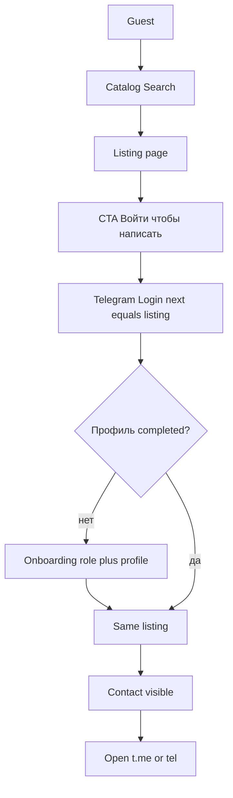
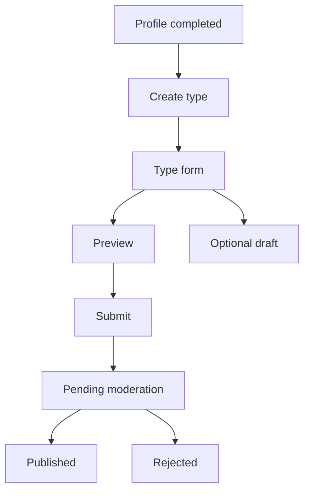
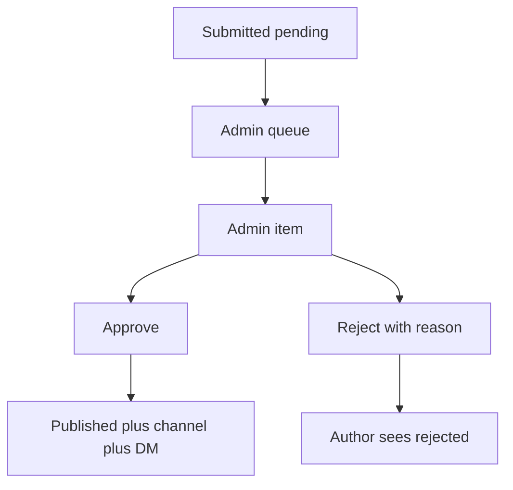
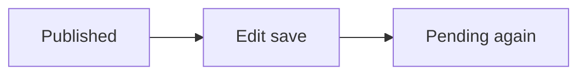

# 02 — User Flows (пользовательские потоки)

**Связано:** [00](00-ux-blueprint.md) · [05](05-auth-contact-flow.md) · [07](07-create-listing.md) · [08](08-moderation.md)

Главный flow продукта: **Browse → Login → Contact** (P-1).

---

## 1. Browse → Contact (гость)



Контекст: `next=/listings/{id}` не теряется на онбординге.

---

## 2. Create Listing



Гость на Создать: Login `next=/create`, затем онбординг, затем `/create`.

---

## 3. Moderation



---

## 4. Edit published (DEC-21)



---

## 5. UX Acceptance Criteria

### AC-P1 Contact gate

```text
Given гость на публичной карточке published
When нажимает «Войти, чтобы написать»
Then открывается вход через Telegram с next на эту карточку
And после успешного входа и completed-профиля
Then пользователь оказывается на той же карточке
And видит «Написать в Telegram» (и «Позвонить», если есть телефон)
And контакт в HTML гостя по-прежнему отсутствует
```

### AC-P1 next после онбординга

```text
Given первый вход с next=/listings/{id}
When пользователь завершает роль и профиль
Then редирект на /listings/{id} а не на Home
```

### AC-Search type

```text
Given published кабинеты и мероприятия
When открыт Поиск с чипом Кабинеты
Then в списке только type=space
```

### AC-Zero results

```text
Given фильтр района без карточек
When список пуст
Then текст: ничего не нашли + сброс фильтров + подсказка Telegram
And не показываются чужие типы «на всякий случай»
```

### AC-Create pending

```text
Given профиль completed
When отправлена форма Space
Then статус pending, карточки нет в публичном поиске
And экран: проверка обычно в течение 24 часов
```

### AC-Moderation approve

```text
Given listing pending
When admin нажимает Одобрить
Then карточка в публичном поиске
And гость может открыть её по URL
```

### AC-Reject

```text
Given listing pending
When admin отклоняет без причины
Then отправка невозможна
When указывает причину и отклоняет
Then автор видит rejected и текст причины
```

### AC-Expired deep link

```text
Given listing expired
When открыт URL карточки
Then «Объявление неактуально»
And кнопки контакта нет
```

### AC-Create guest

```text
Given гость
When нажимает Создать
Then Login с next=/create
And после сессии — выбор типа, не чужая карточка
```
